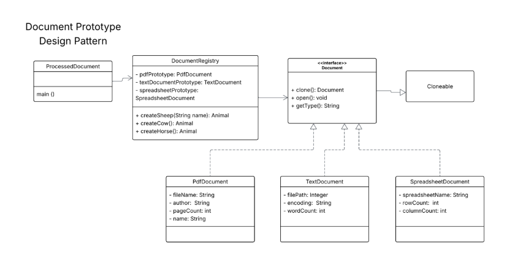

# Prototype-Pattern

**Implement the diagram.  You must produce the following output:  Disregard the comment.**

Creating a PDF Document prototype. //Executed in the constructor  
Creating a Text Document prototype. //Executed in the constructor  
Creating a Spreadsheet Document prototype. ///Executed in the constructor    

Opening PDF Document: annual_report_2024.pdf by Acme Corp (150 pages)  
Type: PDF, File: annual_report_2024.pdf, Author: Acme Corp, Pages: 150    

Opening Text Document: meeting_notes.txt with encoding: UTF-8 (250 words)  
Type: Text, Path: meeting_notes.txt, Encoding: UTF-8, Words: 250    

Opening Spreadsheet Document: sales_data_q1.xlsx (1000 rows, 20 columns)   
Type: Spreadsheet, Name: sales_data_q1.xlsx, Rows: 1000, Columns: 20    

Opening PDF Document: summary_report.pdf by Acme Corp (30 pages)  
